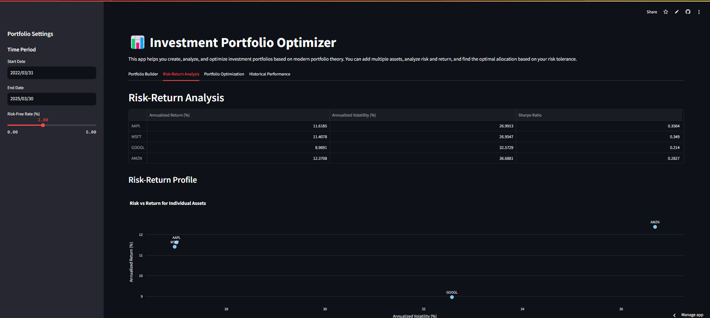
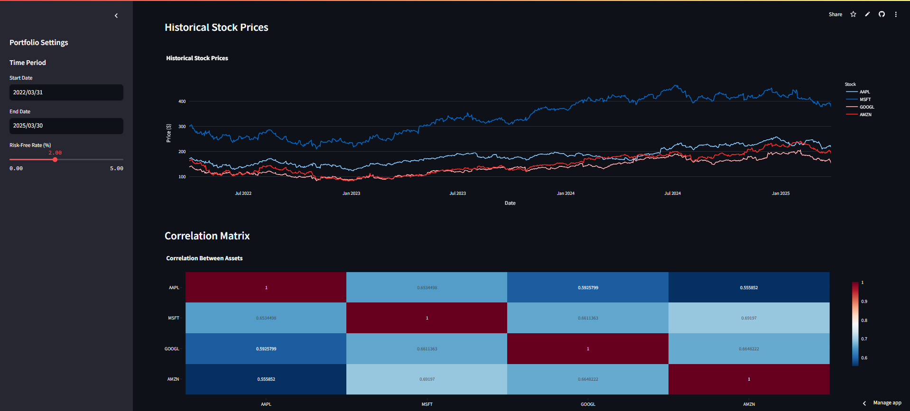

# Investment Portfolio Optimizer

##  Course Information
- **Course Name:** AF3005 – Programming for Finance
- **Instructor:** Dr. Usama Arshad
- **Program:** BS Financial Technology (BSFT)
- **Semester:** Spring 2025
- **Institution:** FAST National University of Computer and Emerging Sciences (FAST-NUCES), Islamabad

##  App Overview

The Investment Portfolio Optimizer is an interactive financial web application built with Streamlit that helps users create, analyze, and optimize investment portfolios based on modern portfolio theory. This tool enables investors to make data-driven decisions by visualizing risk-return profiles, generating efficient frontiers, and comparing portfolio performance against benchmarks.

### Key Features:

- **Portfolio Builder:** Add multiple assets and visualize their historical performance
- **Risk-Return Analysis:** Calculate expected returns, volatility, and Sharpe ratio for individual assets and portfolios
- **Portfolio Optimization:** Generate the efficient frontier and find optimal allocations based on risk tolerance
- **Historical Performance:** Compare portfolio performance against benchmark indices with detailed metrics
- **What-If Scenarios:** Test how portfolio allocations would have performed historically with interactive customization

##  Screenshots

### Portfolio Builder


### Risk-Return Analysis


### Portfolio Optimization


### Historical Performance


### Additional Charts



##  Live App****

You can access the deployed app on Streamlit Cloud:
[Investment Portfolio Optimizer App](https://your-streamlit-app-url.streamlit.app/)

##  Installation Guide

### Prerequisites
- Python 3.8 or higher
- pip (Python package installer)

### Local Setup

1. **Clone the repository:**
   ```bash
   git clone https://github.com/your-username/investment-portfolio-optimizer.git
   cd investment-portfolio-optimizer
   ```

2. **Create a virtual environment (optional but recommended):**
   ```bash
   python -m venv venv
   
   # On Windows
   venv\Scripts\activate
   
   # On macOS/Linux
   source venv/bin/activate
   ```

3. **Install required packages:**
   ```bash
   pip install -r requirements.txt